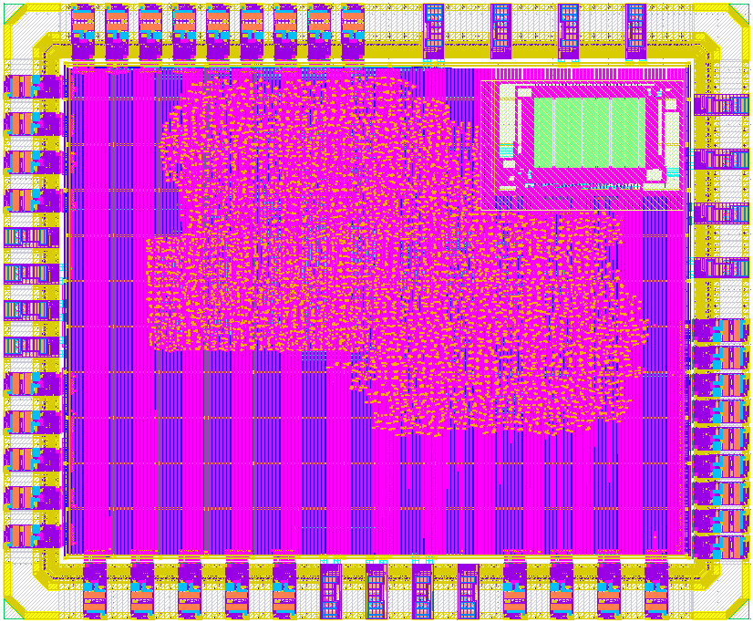

# ZeroSoC

ZeroSoC is a RISC-V SoC designed to demonstrate the capabilities of
[SiliconCompiler][sc]. ZeroSoC consists of an [Ibex core][ibex], UART and GPIO
peripherals from the [OpenTitan][opentitan] project, and 8 KB of RAM.

<p align="center">
  
</p>

## Getting Started

Clone the repository and all its submodules:

```console
$ git clone git@github.com:siliconcompiler/zerosoc.git
$ cd zerosoc
$ git submodule update --init --recursive
$ pip install -r python-requirements.txt
```

Building ZeroSoC locally for ASIC or FPGA targets requires installing external
tools. See [TODO: insert link to docs] for installation instructions. The build
script also supports remote builds, which do not require installing additional
tools.

## Usage

[`build.py`](build.py) is ZeroSoC's build script, based around the SiliconCompiler Python
API. Running this script with no options initiates a local ZeroSoC ASIC build,
and runs DRC and LVS on the final GDS.

Running `build.py --help` gives information on additional options:

```
-h, --help        show this help message and exit
--fpga            Build FPGA bitstream.
--core-only       Only build ASIC core GDS.
--top-only        Only integrate ASIC core into padring. Assumes core already built.
--floorplan-only  Only generate floorplans.
--dump-flowgraph  Only dump diagram of flowgraphs.
--no-verify       Don't run DRC and LVS.
--remote          Run on remote server. Requires SC remote credentials.
```

## Floorplan tutorial

ZeroSoC's floorplan is defined in [`floorplan.py`](floorplan.py) using
SiliconCompiler's Python-based floorplanning API. You can find a step-by-step
tutorial describing how to write this floorplan from scratch here [TODO: insert
link].

## FPGA

For more details on how to run the ZeroSoC FPGA demo, see [here](docs/fpga.md).

## License

[Apache License 2.0](LICENSE)

[sc]: https://github.com/siliconcompiler/siliconcompiler
[ibex]: https://github.com/lowrisc/ibex
[opentitan]: https://github.com/lowrisc/opentitan
